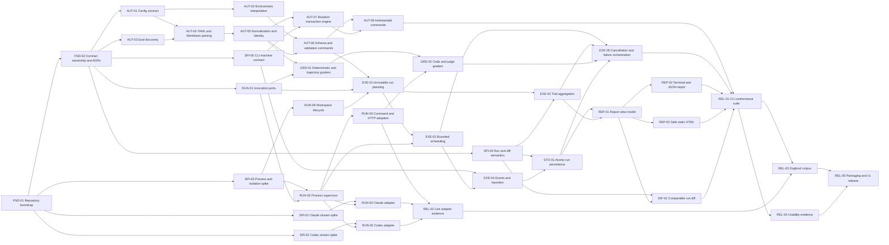

# Provet v1 — Roadmap and Implementation Plan

Execute 38 dependency-ordered tasks across six phases to deliver the local `vet` CLI.

**Status:** pre-build  
**Scope:** roadmap, implementation phases, task steps, gates, and release cuts only

## Execution rules

- Start a task only when every listed dependency is complete.
- Run independent tasks in parallel using the six defined lanes.
- Keep one owner for each public contract while parallel work consumes pinned interfaces.
- Leave every implementation increment type-correct with owned tests passing.
- Keep deterministic, live-adapter, security, and usability evidence as separate gates.
- Begin with `FND-01`; do not fan out implementation before `FND-02` and the Phase 0 spikes stabilize contracts and trust boundaries.

## Tracks and concurrency lanes

| Lane | Primary ownership | Parallelism rule |
| --- | --- | --- |
| A — contracts and authoring | schemas, config, eval formats, validation, mutation commands | Parser and transaction work may parallelize after contract ownership is fixed. |
| B — invocation and workspace | process supervisor, adapters, workspace fixture lifecycle | Adapter implementations may parallelize after the supervisor and adapter port are stable. |
| C — execution and evidence | run planning, scheduling, aggregation, events, persistence | Pure planning/aggregation may parallelize with storage; final orchestration waits for both. |
| D — grading | deterministic, trajectory, code, and judge graders | Deterministic/trajectory and code/judge work may parallelize after grader contracts exist. |
| E — reporting | report model, terminal, HTML, diff | Terminal and fixed HTML may parallelize after the view-model; diff also needs run comparability. |
| F — validation and release | conformance, live smokes, dogfood, usability, packaging | Evidence lanes run independently; release waits for every required gate. |

No more than one task may change an owned public contract at a time. Parallel implementers consume a pinned contract commit and rebase normally; they do not copy or locally widen DTOs.

## DAG

## Critical path and release cut lines

The structural critical path is `FND-01 → FND-02 → AUT-01/AUT-03 → AUT-04 → AUT-05 → AUT-06 → EXE-01 → EXE-02 → EXE-04 → STO-01 → EXE-05 → REP-01 → DIF-01 → REL-01 → REL-03 → REL-05`. `RUN-01/RUN-02` and grader work join before a meaningful end-to-end run; manage them as near-critical lanes.

- **Cut A — deterministic vertical slice:** one command target, one YAML case, deterministic output grader, one trial, atomic run artifact, terminal summary. Requires `FND-01..02`, `SPI-03..05`, `AUT-01..06`, `RUN-01..03`, `RUN-06`, `GRD-01`, `EXE-01..05`, `STO-01`, and `REP-01..02` in their minimum contract-complete form.
- **Cut B — agentic alpha:** Claude and Codex adapters, workspace diffs, trajectory graders, repeats/concurrency, code/judge graders, JSONL, report drill-down, and diff. Requires all implementation nodes through phase 4 except optional template overrides.
- **Cut C — local beta:** every v1 command, Markdown authoring, fixed safe HTML, machine conformance, live adapter smokes, dogfood corpus, documented unsafe-local boundary, and packaging candidates.
- **Cut D — v1:** all required evidence gates green, measured onboarding target, support matrix published, zero unresolved severity-1 security or data-integrity defects, and every product decision above ratified.

## Phase 0 — foundation and risk retirement

### FND-01 — Bootstrap the repository and deterministic toolchain

- **Objective:** create the smallest Bun/TypeScript workspace that can compile, test, lint/format, and execute a placeholder named-export `vet` composition root.
- **Dependencies:** none.
- **Steps:**
  1. Ratify package manager, minimum Bun/Node compatibility, module mode, TypeScript strictness, and supported operating systems.
  2. Create deep source/test directory roots without feature stubs; keep `index.ts` files export-only.
  3. Add one script at a time for typecheck, unit tests, formatting/linting, contract tests, and e2e tests; document every script concurrently.
  4. Inject clock, ID, filesystem, process, Git, and terminal ports in the initial composition design so tests never normalize nondeterminism after the fact.
- **Artifacts:** `package.json`, lockfile, `tsconfig.json`, formatter/linter config, `src/cli/vet-command.ts`, `tests/unit/`, `tests/contracts/`, `tests/integration/`, `tests/e2e/`, `docs/SCRIPTS.md`, `docs/ENV.md`.
- **Tests/evidence:** clean install; `pnpm typecheck`; empty test lanes; built CLI returns version/help without reading config; package-manager and Bun versions recorded.
- **Acceptance:** every script is documented, source has no catch-all files, a clean checkout produces identical generated bytes, and the first commit compiles.
- **Risks:** premature monorepo complexity and Bun-only APIs that block packaging; resolve through an ADR, not incidental imports.

### FND-02 — Ratify domain boundaries, public contracts, and decision ADRs

- **Objective:** make contract ownership and trust boundaries explicit before parallel implementation.
- **Dependencies:** `FND-01`.
- **Steps:**
  1. Translate the repository standard's module map into actual directories and dependency rules.
  2. Draft minimal ports for configuration, eval normalization, invocation, grading, run planning, events, persistence, report view-model, and CLI envelopes.
  3. Resolve adapter privileges, trial naming, isolation claims, grader scope, plugin exports, and report-template gates; record units, nullability, version fields, enum extension policy, and capability limits.
  4. Add compile-time dependency-boundary tests and a public-contract inventory; prohibit duplicate DTO declarations.
- **Artifacts:** `docs/adr/`, purpose-specific files under `src/contracts/`, dependency-rule configuration, `tests/contracts/public-contract-inventory.test.ts`.
- **Tests/evidence:** architecture import tests, TypeScript exhaustiveness checks, schema/DTO ownership review, ADR approval record.
- **Acceptance:** every public data shape has one owner and version; every decision has an accepted answer; parallel lanes can consume pinned contracts without local widening.
- **Risks:** designing abstract ports without evidence; keep stream and storage details provisional until spikes finish.

### SPI-01 — Capture and characterize Claude Code stream behavior

- **Objective:** replace assumptions about `claude -p --output-format stream-json` with sanitized compatibility evidence.
- **Dependencies:** `FND-01`.
- **Steps:**
  1. Record current CLI/version/auth prerequisites without copying credentials.
  2. Capture raw stdout/stderr/exit/signal behavior for text, tools, parallel tools, errors, limits, cancellation, malformed output, and workspace edits.
  3. Map native events to proposed normalized events; mark unavailable, lossy, and version-dependent fields.
  4. Sanitize captures, preserve ordering, and define unsupported-version and partial-trajectory behavior.
- **Artifacts:** `docs/research/claude-code-adapter.md`, sanitized fixtures under `tests/fixtures/adapters/claude-code/`, proposed compatibility matrix.
- **Tests/evidence:** fixture provenance manifest, secret scan, replay parser spike, negative fixtures.
- **Acceptance:** `RUN-04` can implement without guessing event types, cancellation, cost provenance, or degradation policy.
- **Risks:** live CLI access may be unavailable; report that gate separately and do not call synthetic replay live compatibility.

### SPI-02 — Capture and characterize Codex CLI stream behavior

- **Objective:** establish the same evidence for `codex exec --json`.
- **Dependencies:** `FND-01`.
- **Steps:** repeat `SPI-01` for messages, commands/tools, nested agent work, approvals, usage, errors, cancellation, compaction, and workspace effects; document differences rather than forcing false symmetry.
- **Artifacts:** `docs/research/codex-adapter.md`, sanitized fixtures under `tests/fixtures/adapters/codex/`, compatibility matrix.
- **Tests/evidence:** provenance, secret scan, replay parser spike, malformed/partial fixtures.
- **Acceptance:** `RUN-05` has a documented lossless/lossy mapping and supported-version policy.
- **Risks:** Codex event contracts may drift; raw events and detected CLI version remain mandatory provenance.

### SPI-03 — Threat-model subprocesses, credentials, and workspace isolation

- **Objective:** decide what Provet can safely claim and how processes are bounded.
- **Dependencies:** `FND-01`.
- **Steps:**
  1. Enumerate host filesystem, environment, network, process-tree, symlink, terminal-injection, and credential threats.
  2. Prototype explicit argv spawning, minimal environment construction, bounded capture, process groups, graceful/forced termination, and temp permissions.
  3. Test Docker credential/auth feasibility and platform support; compare with clearly labelled `unsafe-local` execution.
  4. Define retained-workspace, redaction, network, and custom-grader trust disclosures.
- **Artifacts:** `docs/security/threat-model.md`, `docs/adr/execution-isolation.md`, adversarial fixtures, supervisor/workspace prototypes confined to spike paths.
- **Tests/evidence:** symlink/traversal, secret inheritance, process escape, forked child, timeout, signal, huge-output, and terminal-control probes.
- **Acceptance:** a human approves the v1 isolation claim and release gate; downstream tasks have explicit capabilities and fail-closed rules.
- **Risks:** local agent authentication inside containers may be impractical; never describe cwd copying as sandboxing.

### SPI-04 — Define run durability, trial aggregation, and comparison semantics

- **Objective:** specify trustworthy artifacts and `vet diff` before storage/report code freezes weak semantics.
- **Dependencies:** `FND-02`.
- **Steps:**
  1. Define run/trial state machines, staging/finalization, atomic rename/fsync assumptions, concurrent writers, `latest`, cleanup, and interrupted artifacts.
  2. Define `all`, `any`, and ratio denominators/rounding for pass, fail, grader error, target error, timeout, cancellation, and skip.
  3. Define case identity, snapshot/config/grader/adapter fingerprints, comparable/incompatible rules, added/removed cases, unknown measures, and candidate-minus-baseline deltas.
  4. Produce worked truth tables and future SQLite import invariants.
- **Artifacts:** `docs/contracts/run-lifecycle.md`, `docs/contracts/trial-policy.md`, `docs/contracts/run-diff.md`, schema examples.
- **Tests/evidence:** model-based state-machine tests, truth-table fixtures, property-test plan, crash/fault matrix.
- **Acceptance:** no report/diff rule depends on prose interpretation; all non-happy states have storage and exit semantics.
- **Risks:** overselling repeat ratios as pass@k and comparing runs with changed graders; incompatibility must be explicit.

### SPI-05 — Freeze CLI streams, envelopes, diagnostics, and exit precedence

- **Objective:** turn the CLI and agent UX standards into byte-level contracts.
- **Dependencies:** `FND-02`.
- **Steps:** define parser grammar, global-flag position, TTY and non-TTY streams, JSON/JSONL schemas, terminal events, error envelopes, diagnostic pointers/ranges/remediation, exit precedence, cancellation, and truncation metadata; create cross-command golden examples.
- **Artifacts:** CLI envelope/event/error schemas, `docs/contracts/cli-protocol.md`, golden stdout/stderr fixtures.
- **Tests/evidence:** schema validation, balanced terminal sequences, closed-stdin probe, handled-error stdout purity, noninteractive timeout.
- **Acceptance:** every v1 command can be snapshot-tested in human, JSON, and applicable JSONL modes with no ambiguous stream ownership.
- **Risks:** bootstrap failures before JSON creation and mixed reporter modes; limit exceptions to the documented internal-failure boundary.

## Phase 1 — definition, discovery, validation, and authoring

### AUT-01 — Implement `provet.yaml` schema, loading, and defaults

- **Objective:** load one versioned configuration into an immutable normalized project configuration.
- **Dependencies:** `FND-02`.
- **Steps:** define strict schema for target, judges, defaults, report, timeouts, concurrency, repeats, and pass policy; parse YAML safely; discover upward; apply defaults in one pure normalizer; reject unknown/broken major versions with pointers.
- **Artifacts:** `src/config/config-schema.ts`, `config-loader.ts`, `config-normalizer.ts`, fixtures and contract tests under dedicated test trees.
- **Tests/evidence:** valid/minimal/full configs, duplicate keys, anchors, excessive depth/size, unknown fields, discovery precedence, future version, stable normalized snapshot.
- **Acceptance:** no adapter or command reinterprets raw config; resolved config path and schema version are provenance.
- **Risks:** YAML ambiguity and hidden defaults; normalized JSON must expose every effective value.

### AUT-02 — Implement bounded environment interpolation and redaction registration

- **Objective:** resolve `${VAR}` only where the schema permits without persisting secret values.
- **Dependencies:** `AUT-01`.
- **Steps:** parse interpolation without shell semantics; distinguish unset, empty, escaped, and malformed references; register resolved secrets with the redactor before diagnostics/storage; retain variable-name provenance; prohibit magic behavioral environment switches.
- **Artifacts:** `src/config/environment-interpolator.ts`, `src/security/secret-redactor.ts`, focused tests and `docs/ENV.md` updates.
- **Tests/evidence:** multiple variables, literals, unset/empty values, secret in errors/events/HTML, overlapping secrets, large values, Unicode.
- **Acceptance:** secret values never enter normalized printable config or any golden; failures name variable and pointer only.
- **Risks:** short/common secrets causing over-redaction; define minimum matching and structured-field policies.

### AUT-03 — Implement deterministic eval discovery

- **Objective:** find directory manifests and single-file shorthand with stable ordering and containment.
- **Dependencies:** `FND-02`.
- **Steps:** define roots and ignore rules; canonicalize paths after symlink resolution; detect duplicate/ambiguous names; sort independent of filesystem order; return discovery diagnostics rather than partial silent success.
- **Artifacts:** `src/evals/eval-discovery.ts`, path-containment module, discovery fixtures.
- **Tests/evidence:** mixed formats, symlink escape, case-sensitive collisions, nested roots, unreadable files, deterministic order.
- **Acceptance:** identical trees yield identical eval lists across supported platforms; unsafe paths fail before file content is trusted.
- **Risks:** platform path/case differences; publish the support policy and keep IDs slash-normalized.

### AUT-04 — Parse YAML and Markdown cases into one source-aware syntax model

- **Objective:** support directory cases, Markdown frontmatter/body, and single-file shorthand without losing diagnostic locations.
- **Dependencies:** `AUT-01`, `AUT-03`.
- **Steps:** parse bounded YAML and frontmatter; retain source path, document index, ranges, and raw body; validate format-local structure; keep semantic normalization out of parsers; apply the grader-scope decision ratified by `FND-02` without hidden shared-grader syntax.
- **Artifacts:** purpose-specific parsers under `src/evals/formats/`, syntax DTOs, fixtures for prose, multiline YAML, frontmatter, and malformed documents.
- **Tests/evidence:** round-trip source locations, duplicate IDs/keys, empty body/input, delimiter edge cases, injection strings, large files.
- **Acceptance:** equivalent YAML and Markdown inputs feed the same later normalizer while errors point to original source.
- **Risks:** Markdown/YAML parser behavior drift; pin dependencies and add adversarial fixture contracts.

### AUT-05 — Normalize cases, identities, overrides, and grader references

- **Objective:** produce one immutable `NormalizedEvalCase` with globally stable identity.
- **Dependencies:** `AUT-04`.
- **Steps:** build `<eval>/<case>` IDs; apply project/eval/case precedence for target, repeat, pass policy, timeout, and workspace; resolve grader paths and named judges relative to owning documents; preserve source references and calculate semantic fingerprints.
- **Artifacts:** `src/evals/eval-normalizer.ts`, `case-identity.ts`, `override-resolution.ts`, contract tests.
- **Tests/evidence:** precedence matrix, duplicate IDs, path bases, renamed/moved cases, unknown judge, stable hashes, field-order independence.
- **Acceptance:** run planning consumes only normalized cases; identity/fingerprints are sufficient for diff compatibility decisions.
- **Risks:** hashes polluted by timestamps/absolute paths; define canonical serialization explicitly.

### AUT-06 — Implement complete validation and schema discovery

- **Objective:** make `vet validate` and `vet schema` the authoritative agent authoring loop.
- **Dependencies:** `AUT-02`, `AUT-05`.
- **Steps:** aggregate syntax, schema, reference, containment, and cross-file diagnostics; sort/coalesce deterministically; emit human/JSON contracts; publish exact config/eval-case/grader/run schemas; guarantee zero target/judge calls and zero writes.
- **Artifacts:** validator orchestration, schema registry, validate/schema commands, JSON pointer/range mapper, golden tests.
- **Tests/evidence:** multiple simultaneous errors, warning behavior, no-project schema/help, closed stdin, network/process spies, stable ordering.
- **Acceptance:** a structurally valid project cannot hit an avoidable parse/schema/reference error during run; machine errors validate against the envelope schema.
- **Risks:** validation that imports arbitrary grader code; validate paths/module shape without executing repository code.

### AUT-07 — Build preview-hash-bound atomic mutation transactions

- **Objective:** provide one safe engine for all authoring writes.
- **Dependencies:** `AUT-05`, `SPI-05`.
- **Steps:** model create/update/unchanged/conflict plans; compute before/after content hashes; make dry-run strictly zero-write/zero-lock; re-read and revalidate hashes under the real writer; stage all bytes before atomic multi-file commit; preserve unrelated content and recover from partial filesystem failures.
- **Artifacts:** `src/evals/authoring/mutation-plan.ts`, `atomic-project-writer.ts`, lock/rollback ports, fault-injection tests.
- **Tests/evidence:** idempotent replay, stale preview, force boundaries, symlinks, permission failure at each write, no timestamp changes in dry-run, byte preservation.
- **Acceptance:** a failed mutation leaves every original file byte-identical; `--force` never bypasses validation, containment, or preview drift.
- **Risks:** portable multi-file atomicity; document the exact lock/staging protocol and recoverable journal if needed.

### AUT-08 — Implement `init`, `new eval`, `add case`, and `add grader`

- **Objective:** expose all v1 authoring operations through the transaction engine.
- **Dependencies:** `AUT-06`, `AUT-07`.
- **Steps:** define typed command inputs; scaffold a runnable generic-command example; implement directory/file and YAML/Markdown variants; accept exactly one case input source; add per-case graders; optionally insert versioned Provet agent guidance only when requested; return ordered file operations in JSON.
- **Artifacts:** one command module per command under `src/cli/commands/`, templates under purpose-specific authoring directories, e2e goldens.
- **Tests/evidence:** every example in CLI standard, identical rerun, conflicts, stdin EOF/size, unmarked/marked `AGENTS.md`, force and dry-run matrices.
- **Acceptance:** a clean user can initialize and author without an editor or prompt; all mutations validate and use one writer.
- **Risks:** generated example depending on installed agent credentials; the default must run locally and deterministically.

## Phase 2 — invocation, workspaces, and graders

### RUN-01 — Implement capability-limited invocation contracts

- **Objective:** define normalized request, event, result, usage, and cancellation seams for targets and judges.
- **Dependencies:** `FND-02`.
- **Steps:** define transport-neutral events and raw-event references; model capability availability and trajectory completeness; separate target workspace privileges from judge evidence-only input; normalize `null` usage/cost; version every event/result.
- **Artifacts:** purpose-specific contracts under `src/adapters/contracts/`, compile-time fixtures, schema definitions.
- **Tests/evidence:** exhaustive event/result construction, unknown/additive fields, incomplete trajectory, unknown cost, capability denial.
- **Acceptance:** all adapters can conform without widening contracts and a judge cannot acquire target privileges through shared plumbing.
- **Risks:** lowest-common-denominator normalization; preserve raw evidence and explicit lossiness.

### RUN-02 — Implement the bounded process supervisor

- **Objective:** provide one correct subprocess primitive for command, Claude, Codex, and CLI judges.
- **Dependencies:** `RUN-01`, `SPI-03`.
- **Steps:** spawn explicit executable/argv without shell by default; build minimal environment; stream bounded stdout/stderr with backpressure; manage process groups, timeout, abort, grace, kill, and reap; expose ordered chunks and terminal status; redact before sinks.
- **Artifacts:** `src/adapters/process/process-supervisor.ts`, environment builder, output limiter, signal controller, integration helper executable.
- **Tests/evidence:** spaces/metacharacters, forked descendants, huge output, partial UTF-8/JSONL, timeout races, first/second SIGINT, nonzero exit, missing executable.
- **Acceptance:** no child survives cancellation tests; semantic events remain ordered; overflow and truncation are explicit.
- **Risks:** cross-platform signal behavior; declare supported guarantees and test each release platform.

### RUN-03 — Implement generic command and HTTP adapters

- **Objective:** deliver the escape hatches and the deterministic vertical-slice target.
- **Dependencies:** `RUN-01`, `RUN-02`.
- **Steps:** implement literal `{{input}}` substitution without implicit shell; support raw or versioned vet-events JSONL; implement bounded POST with explicit headers/body contract, abort, timeout, response-size and optional trajectory validation; redact URLs/headers; preserve raw evidence.
- **Artifacts:** `src/adapters/command/command-adapter.ts`, `src/adapters/http/http-adapter.ts`, parsers, fake HTTP/process integration fixtures.
- **Tests/evidence:** malformed JSONL, output-only command, HTTP errors/status/content types, abort, SSRF policy decision, secret headers, unknown usage.
- **Acceptance:** both adapters pass one shared conformance suite and report capability differences explicitly.
- **Risks:** shell injection and arbitrary network destinations; execution is explicit user authority but never hidden.

### RUN-04 — Implement Claude Code adapter from captured evidence

- **Objective:** normalize supported Claude Code streams without inventing events.
- **Dependencies:** `RUN-02`, `SPI-01`.
- **Steps:** construct versioned argv; detect supported CLI version; parse incrementally; map messages/tools/results/usage; retain raw streams; surface partial trajectory and protocol drift; integrate cancellation and workspace cwd.
- **Artifacts:** `src/adapters/claude-code/`, replay tests, opt-in live smoke definition.
- **Tests/evidence:** every sanitized fixture, malformed/partial line, unknown event, nonzero exit, tool error, concurrency, cancellation, missing CLI/auth.
- **Acceptance:** replay is deterministic and live evidence is reported separately; unsupported drift cannot silently pass trajectory graders.
- **Risks:** hidden/provider-specific cost fields and auth behavior; unknown stays `null` with provenance.

### RUN-05 — Implement Codex CLI adapter from captured evidence

- **Objective:** normalize supported Codex streams with the same guarantees as `RUN-04`.
- **Dependencies:** `RUN-02`, `SPI-02`.
- **Steps/artifacts/tests:** mirror the Claude adapter workflow in `src/adapters/codex/` while retaining Codex-specific nested-agent, approval, tool, usage, and error semantics; do not copy-modify the parser where a shared framed-JSONL primitive is sufficient.
- **Acceptance:** shared adapter conformance and all Codex replay fixtures pass; incomplete or unsupported streams remain explicit.
- **Risks:** assuming Claude/Codex symmetry; share transport mechanics only.

### RUN-06 — Implement fixture workspace lifecycle and diff evidence

- **Objective:** give every trial an independent, contained, inspectable workspace.
- **Dependencies:** `SPI-03`.
- **Steps:** canonicalize and validate fixture root; copy files/permissions/symlinks under policy; create permission-restricted unique trial cwd; snapshot pre/post manifests and hashes; calculate additions/deletions/modifications/mode/symlink changes; retain or clean by documented outcome; record isolation mode.
- **Artifacts:** purpose-specific modules under `src/workspaces/`, manifest/diff contracts, adversarial fixture trees.
- **Tests/evidence:** symlink/hardlink escape, nested Git, ignored/untracked files, binary/large files, executable modes, cleanup fault, concurrent trials.
- **Acceptance:** source fixture/repository bytes never change and `files_untouched` consumes trustworthy manifest evidence.
- **Risks:** this is not host isolation; diagnostics and provenance must say `unsafe-local` unless an accepted sandbox is active.

### GRD-01 — Implement deterministic and trajectory grading

- **Objective:** provide equals, contains, regex, JSON Schema, called/never-called tool, min/max steps, and files-untouched grading as pure functions.
- **Dependencies:** `AUT-05`, `RUN-01`, `RUN-06`.
- **Steps:** define grader input/verdict/reason codes; compile expectations into explicit graders; handle Unicode/JSON/regex bounds; evaluate normalized trajectory capabilities before assertions; use workspace manifest evidence; return error distinct from fail when evidence is incomplete.
- **Artifacts:** purpose-specific files under `src/graders/deterministic/` and `trajectory/`, shared verdict contracts, property and fixture tests.
- **Tests/evidence:** edge/boundary cases, catastrophic-regex protection, missing result/tool input, parallel tools, incomplete trajectory, symlink/file patterns.
- **Acceptance:** pure deterministic output, stable reasoning codes, no adapter/storage imports, and no unavailable evidence treated as ordinary failure.
- **Risks:** tool-name normalization and step definition; freeze them in contracts and fixtures.

### GRD-02 — Implement trusted code graders and least-privilege agent judges

- **Objective:** support the two extensible grader tiers without conflating errors with semantic failures.
- **Dependencies:** `GRD-01`, `RUN-03`, `FND-02`.
- **Steps:** validate and load trusted TypeScript `grade(ctx)` modules with bounded execution/cancellation policy; expose immutable case/output/trajectory/post-workspace inputs; frame untrusted judge evidence and rubric; invoke configured judge without target workspace/tools; validate `{pass, score, reasoning}`; retry once with bounded parse feedback; track judge usage separately.
- **Artifacts:** `src/graders/code/`, `src/graders/judge/`, loader and verdict schemas, injection/parse/timeout fixtures.
- **Tests/evidence:** default-export compatibility, module error/cache, mutation attempts, prompt-injection corpus, oversized trajectory/truncation, invalid score/schema, retry, judge target failure.
- **Acceptance:** every failure stage yields typed `grader-error`; judge cannot mutate target state; raw evidence, truncation, rubric/config hash, and judge provenance persist.
- **Risks:** custom code is trusted in v1 and judge input may leak secrets; disclose the former and redact/frame the latter before invocation.

## Phase 3 — execution, events, and durable run artifacts

### EXE-01 — Build immutable run planning

- **Objective:** resolve one complete run snapshot before starting any target.
- **Dependencies:** `AUT-06`, `RUN-01`, `RUN-06`.
- **Steps:**
  1. Select normalized cases with shell-independent full-ID filters; reject empty selection.
  2. Resolve CLI overrides and case/eval/project defaults, then expand deterministic trial IDs.
  3. Fingerprint config, cases, graders, adapters, Git commit/dirty state, platform, CLI versions, and isolation mode.
  4. Freeze budgets, ordering keys, workspace plans, and expected capabilities; later file edits cannot affect the plan.
- **Artifacts:** `src/execution/run-planner.ts`, `trial-plan.ts`, `selection-filter.ts`, snapshot schema and property tests.
- **Tests/evidence:** precedence/filters, stable order/hash, dirty Git, changed files after plan, empty selection, unknown judge/adapter capability.
- **Acceptance:** the plan is serializable, contains no secret values, and fully explains what will run before effects begin.
- **Risks:** absolute paths and volatile metadata destabilizing fingerprints; canonicalize platform-independent semantic content.

### EXE-02 — Implement bounded, deterministic scheduling

- **Objective:** execute trial plans concurrently without sharing mutable state or changing semantic output order.
- **Dependencies:** `EXE-01`, `RUN-02`.
- **Steps:** implement a bounded worker scheduler over trials; acquire unique workspace and adapter resources; propagate suite/trial abort signals; apply rate/budget admission; emit completion into an ordered reducer rather than filesystem completion order; stop scheduling after terminal cancellation or fatal storage/security error.
- **Artifacts:** `src/execution/trial-scheduler.ts`, `resource-budget.ts`, fake task harness, concurrency integration tests.
- **Tests/evidence:** concurrency 1/N, out-of-order finish, starvation, synchronous throw, abort races, rate-limit feedback, workspace uniqueness, no unhandled promises.
- **Acceptance:** active trials never exceed the bound, persisted semantic order is stable, and cancellation leaves no newly scheduled work.
- **Risks:** provider throttling and head-of-line blocking; keep policy injected and observable rather than hidden retries.

### EXE-03 — Aggregate trials and case outcomes

- **Objective:** reduce trials into honest case/run results under the ratified policy.
- **Dependencies:** `EXE-01`, `SPI-04`, `FND-02`.
- **Steps:** implement `all`, `any`, and ratio truth tables; preserve counts by pass/fail/grader-error/target-error/timeout/cancelled/skipped; compute pass rate and score distribution only over specified denominators; sum known usage while keeping unknown components explicit; produce stable run totals.
- **Artifacts:** `src/execution/trial-aggregator.ts`, `case-aggregator.ts`, `run-aggregator.ts`, property tests from truth tables.
- **Tests/evidence:** zero/one/many trials, ratio boundaries and floating-point representation, mixed errors, unequal repeats, partial run, unknown cost, order independence.
- **Acceptance:** no grader/infrastructure error is silently counted as semantic failure; every aggregate can be recomputed from persisted trials.
- **Risks:** ratio rounding and incomplete-run presentation; store numerator/denominator and raw outcome counts.

### EXE-04 — Implement normalized events and human/JSONL reporters

- **Objective:** make long runs observable without contaminating machine output or stored trajectories.
- **Dependencies:** `EXE-02`, `SPI-05`.
- **Steps:** assign monotonically increasing emission sequences; emit run/case/trial/grader lifecycle and exactly one terminal event; keep concise references to detailed artifacts; render TTY in-place progress and append-only non-TTY stderr; emit schema-valid JSONL stdout; redact/control-character escape before any sink.
- **Artifacts:** `src/execution/run-event-bus.ts`, `src/cli/reporters/human-run-reporter.ts`, `jsonl-run-reporter.ts`, event schemas and byte goldens.
- **Tests/evidence:** parallel completions, handled/fatal error after stream start, narrow/non-TTY terminals, backpressure, ANSI rules, newline restoration, secret/control input.
- **Acceptance:** event sequence is total and schema-valid; stdout contains only JSONL in that mode; terminal event matches exit outcome.
- **Risks:** event bus becoming persistence; keep semantic event construction separate from delivery sinks.

### STO-01 — Persist atomic, immutable run directories

- **Objective:** store crash-explainable JSON/JSONL artifacts under `.provet/runs/<id>/` and publish `latest` safely.
- **Dependencies:** `EXE-04`, `SPI-04`.
- **Steps:** reserve collision-safe run ID; create staging directory with restrictive permissions; append framed per-trial raw/normalized events and status checkpoints; fsync/close as platform policy requires; materialize summary from authoritative events; validate artifact schema/integrity; atomically finalize; update portable latest pointer only after success; mark/retain interrupted state under policy.
- **Artifacts:** `src/runs/run-writer.ts`, `run-reader.ts`, `run-finalizer.ts`, `latest-run-pointer.ts`, integrity manifest and fault-injection fixtures.
- **Tests/evidence:** crash/failure at every boundary, concurrent writers, partial JSONL, corrupt/tampered artifact, pointer failure, read-only disk, Windows symlink alternative, redaction before write.
- **Acceptance:** completed runs never mutate, readers distinguish staged/interrupted/corrupt/future versions, and no failed run becomes `latest` successful evidence.
- **Risks:** false atomicity across filesystems; document exact guarantees and use a manifest/state marker readers verify.

### EXE-05 — Compose full run lifecycle, cancellation, and exit mapping

- **Objective:** wire planning, workspace, target, grading, aggregation, events, and storage into `vet run` with typed failure boundaries.
- **Dependencies:** `EXE-02`, `EXE-03`, `GRD-02`, `STO-01`.
- **Steps:** create composition root and per-trial state machine; invoke target then graders under budgets; persist evidence at each transition; stop/continue according to typed severity; implement first/second SIGINT behavior; finalize partial/failed/completed runs; map all accumulated outcomes through stable exit precedence; return final JSON envelope when requested.
- **Artifacts:** `src/execution/execute-run.ts`, `execute-trial.ts`, `src/cli/commands/run-command.ts`, lifecycle integration tests.
- **Tests/evidence:** pass/fail/grader error/target error/timeout/security/storage/internal error, multiple simultaneous outcomes, SIGINT, JSON vs JSONL conflict, zero matches, changed source mid-run.
- **Acceptance:** the deterministic vertical slice works end to end and every terminal path either finalizes a truthful artifact or reports why durable evidence could not be written.
- **Risks:** catch-all orchestration and swallowed causes; keep typed stage errors and narrow collaborators.

### Phase 3 exit gate

Cut A is green only when a clean temp project can run a deterministic command target twice, produce schema-valid immutable artifacts, report stable bytes, survive injected write/process faults, and leave no child or temp workspace behind. Passing fake adapters is deterministic correctness, not Claude/Codex compatibility.

## Phase 4 — reporting and comparison

### REP-01 — Materialize one versioned report view-model

- **Objective:** expose the same facts to terminal, JSON, HTML, and future dashboard consumers.
- **Dependencies:** `STO-01`, `EXE-03`.
- **Steps:** read and validate supported run artifacts; project run/case/trial/grader/trajectory/workspace evidence into one immutable DTO; separate target and judge measurements; preserve `null`, truncation, redaction, integrity, partial, and compatibility metadata; add case selector without losing run context.
- **Artifacts:** `src/reporting/report-view-model.ts`, `src/runs/run-artifact-validator.ts`, JSON schema and golden fixtures.
- **Tests/evidence:** all statuses, corrupt/future/partial run, requested/missing case, unknown usage, truncated trajectory, redacted fields, stable ordering.
- **Acceptance:** renderers contain no business aggregation logic and all report JSON validates against one schema.
- **Risks:** hiding raw evidence behind a lossy view; include stable artifact references and explicit omissions.

### REP-02 — Implement terminal and JSON report drill-down

- **Objective:** make `vet report [run] [--case] [--json]` useful to humans and agents.
- **Dependencies:** `REP-01`.
- **Steps:** resolve exact/path/latest selectors; render accessible summary and labelled narrow-width fallback; show transcript/tool calls, grader reasoning, and measurements for drill-down; enforce stdout/stderr and color rules; preserve completed failing results with nonzero exit.
- **Artifacts:** `src/cli/commands/report-command.ts`, `src/reporting/terminal-report-renderer.ts`, snapshots for every width/mode/status.
- **Tests/evidence:** missing/ambiguous/corrupt selector, partial run, case filter, control characters, TTY/non-TTY, JSON schema, target/judge cost separation.
- **Acceptance:** human meaning never depends on color/columns and machine output is exactly one envelope.
- **Risks:** huge trajectories flooding terminal/context; disclose truncation and point to stored artifact or narrower selection.

### REP-03 — Implement safe self-contained HTML and gate template overrides

- **Objective:** render a static document from the report view-model without creating an application or unsafe sink.
- **Dependencies:** `REP-01`, `FND-02`.
- **Steps:** choose/pin a small templating engine or justify a purpose-built renderer; escape every untrusted value by default; apply CSP/no remote resources; bound embedded transcript/artifact sizes; make output deterministic after injected provenance normalization; write atomically; implement `--open` only after success and only under allowed TTY/mode; add project partial overrides only after fixed-report adversarial tests pass.
- **Artifacts:** `src/reporting/html/`, built-in templates/partials, `src/cli/commands/report-html.ts`, security and render snapshots.
- **Tests/evidence:** script/style/link/data-URI injection, malformed Unicode, secrets, huge/binary content, custom-partial validation, no-network render, atomic failure, `--open` restrictions.
- **Acceptance:** one fixed report passes security review; optional overrides cannot bypass escaping/redaction/CSP; output is a document with no server.
- **Risks:** templates execute arbitrary logic or expose raw DTOs; keep helpers allowlisted and view-model immutable.

### DIF-01 — Implement compatibility-aware `vet diff`

- **Objective:** make candidate-minus-baseline comparison the trustworthy daily-driver command.
- **Dependencies:** `REP-01`, `SPI-04`.
- **Steps:** resolve and validate two run selectors; compare schema/config/case/grader/adapter/normalizer fingerprints; match full case IDs; classify improved/regressed/unchanged/added/removed/incompatible; compare pass numerator/denominator, score distributions, trial counts, statuses, and known target/judge cost/token/latency deltas; surface dirty Git and partial evidence; render human/JSON and exit `1` only for defined regression while incompatible comparisons use typed error semantics.
- **Artifacts:** `src/reporting/diff/run-comparator.ts`, `diff-view-model.ts`, `src/cli/commands/diff-command.ts`, truth-table and property tests.
- **Tests/evidence:** added/removed, pass↔fail/error, unequal repeats, unknown measures, changed rubric/target/config/schema, dirty commits, partial/corrupt run, antisymmetry of numeric deltas, stable order.
- **Acceptance:** no materially incompatible run is shown as a fair regression result and every delta states direction and denominator.
- **Risks:** users wanting a diff despite drift; report diagnostic detail but do not guess unless a future explicit override contract is approved.

### Phase 4 exit gate

Cut B is green when one fixture suite runs through command, HTTP, Claude replay, and Codex replay adapters; deterministic/trajectory/code/judge graders; repeats and concurrency; report drill-down; safe fixed HTML; and a baseline/candidate diff with correct errors, fingerprints, and cost separation. Live CLIs remain a separate gate.

## Phase 5 — evidence, dogfood, usability, packaging, and release

### REL-01 — Build the cross-command conformance and adversarial suite

- **Objective:** prove the normative repository, CLI, and agent UX contracts across every v1 command.
- **Dependencies:** `AUT-08`, `EXE-05`, `REP-02`, `REP-03`, `DIF-01`.
- **Steps:** invoke the built binary in TTY-like/non-TTY human, JSON, and applicable JSONL modes; validate stdout/stderr bytes, schemas, exits, writes, signals, closed stdin, and platform paths; execute agent golden journey; add security, corruption, concurrency, cancellation, and atomic-write matrices; ensure scripts/docs are synchronized.
- **Artifacts:** dedicated `tests/e2e/` and `tests/security/` suites, cross-platform fixture runner, conformance coverage matrix, `docs/TESTING.md`.
- **Tests/evidence:** all standard conformance rows plus unsupported flags, future schemas, multiple errors, secret/control injection, path escapes, child escape, disk faults, huge content, package install smoke.
- **Acceptance:** required deterministic suite is hermetic and green on supported platforms; no test calls a live provider or depends on user credentials.
- **Risks:** snapshots masking semantics; normalize through injected providers and require human inspection of golden changes.

### REL-02 — Establish opt-in live adapter compatibility evidence

- **Objective:** verify current Claude Code, Codex, HTTP, and command behavior without contaminating required offline CI.
- **Dependencies:** `RUN-03`, `RUN-04`, `RUN-05`.
- **Steps:** define secret-safe opt-in smoke manifests and budgets; run minimal message/tool/workspace/cancel cases; record CLI/provider versions and timestamps; compare native raw streams with replay fixtures; sanitize new captures; publish capability matrix and degradation results separately.
- **Artifacts:** opt-in smoke harness, `docs/compatibility/adapters.md`, sanitized replay update process, evidence report template.
- **Tests/evidence:** actual live invocations where authorized, with cost and secret scan; explicit unavailable/skipped report otherwise.
- **Acceptance:** supported-version claims are backed by current live evidence; a deterministic green suite is never labelled compatibility proof.
- **Risks:** auth, cost, rate limits, network, and provider drift; cap spend and never store/forward local CLI credentials.

### REL-03 — Dogfood Provet on representative coding-agent regressions

- **Objective:** prove the product loop on realistic tasks and make Provet evaluate Provet.
- **Dependencies:** `REL-01`, `REL-02`.
- **Steps:** curate small deterministic-first cases for config authoring, safe file edits, tool use, forbidden paths, cancellation, judge injection, and regression diff; include Claude/Codex cases only in opt-in lane; create known good/bad candidate changes; record expected trajectory capabilities and cost budgets; triage every mismatch as product, adapter, grader, or corpus defect.
- **Artifacts:** `evals/` dogfood suites, synthetic fixtures, rubrics/graders, baseline artifacts excluded or sanitized by policy, `docs/testing/dogfood.md`.
- **Tests/evidence:** repeat distributions, regressions/improvements, false-positive/negative review, target/judge cost, run integrity.
- **Acceptance:** Cut B workflow finds intentional regressions and explains failures without manual artifact surgery; no case requires cloud services.
- **Risks:** self-confirming tests and brittle exact trajectories; mix invariant assertions with reviewed judge rubrics and preserve raw evidence.

### REL-04 — Validate five-minute onboarding and agent usability

- **Objective:** measure the north-star metric with humans and autonomous agents, not infer it from passing e2e tests.
- **Dependencies:** `REL-01`.
- **Steps:** define representative novice/expert/agent participant profiles and clean-machine scenarios; measure install→init→validate→first green run, error recovery, case authoring, report, and diff; include no Bun, no CLI login, invalid config, generic command target, narrow terminal, and machine-mode paths; log friction and severity; re-run after fixes.
- **Artifacts:** usability protocol, anonymized notes/metrics, issue list, `docs/research/v1-usability-results.md`.
- **Tests/evidence:** median/p90 task time, success rate, help/schema use, diagnostic repair rate, agent token/command counts, qualitative blockers.
- **Acceptance:** zero-to-first-green is under five minutes for the ratified target cohort and agents complete the golden journey without prose parsing or human prompts.
- **Risks:** testing only maintainers or preconfigured machines; require clean environments and disclose sample limits.

### REL-05 — Package, verify, and release v1

- **Objective:** publish a reproducible local CLI only after product, security, compatibility, and usability gates pass.
- **Dependencies:** `REL-03`, `REL-04`.
- **Steps:** finalize package/bin name availability and `vet` invocation; lock supported Bun/platform matrix; verify npm pack contents, install/global/bunx paths, executable behavior, licenses, source maps, size/startup; generate changelog and public contract docs; run clean tarball smoke and the full deterministic suite; review live evidence, security findings, decisions, migrations (none), and v1 scope; tag/publish only with human approval.
- **Artifacts:** package metadata, release checklist, changelog, compatibility/security/known-limit docs, reproducible tarball evidence.
- **Tests/evidence:** `npm pack --dry-run`, tarball inventory/secret scan, install in empty temp directories, `vet --version --json`, full conformance, opt-in current provider smokes, dogfood and usability reports.
- **Acceptance:** Cut D conditions hold; `vet` performs no telemetry/upload; run files remain v1.1-importable; zero unresolved severity-1 security/data-integrity bugs; publication has explicit human authorization.
- **Risks:** npm/binary name collision, single-platform success, accidental secret/fixture packaging, and calling beta evidence production-ready.

## Phase gates and evidence ledger

| Gate | Required evidence | Does not prove |
| --- | --- | --- |
| G0 — contracts ratified | ADRs, spike fixtures, threat model, state/diff truth tables, CLI goldens | Any runtime works |
| G1 — authoring | schema/validator contracts, zero-write validation, mutation fault tests, agent authoring journey through validate | Targets or graders work |
| G2 — deterministic runtime | command/HTTP conformance, workspace adversarial tests, grader unit/property tests, atomic run artifacts | Claude/Codex live compatibility or judge quality |
| G3 — full local feature set | all commands, replay adapters, repeats, JSONL, HTML, diff, cross-command e2e | Current provider compatibility or usability |
| G4 — provider compatibility | opt-in current live adapter smokes with versions and sanitized provenance | Semantic judge quality or human usability |
| G5 — trust/usability | dogfood regressions, judge injection review, human/agent onboarding study, security review | Hosted/cloud/CI product readiness |
| G6 — release | package/tarball/install checks plus G0..G5 and explicit human approval | Post-v1 features |

Human evaluation evidence is append-only: reviewer labels, calibration notes, and adjudication MUST NOT overwrite raw machine outcomes. V1 has no annotation queue; evidence may live in reviewed research documents and sanitized fixtures. Required CI stays deterministic/offline. Live-provider lanes are opt-in and budgeted. Usability results are observed participant evidence, not e2e-test inference.

## Parallel execution waves

1. **Wave 0:** `FND-01`; then `FND-02`, `SPI-01`, `SPI-02`, `SPI-03` in parallel; then `SPI-04` and `SPI-05`.
2. **Wave 1:** `AUT-01`, `AUT-03`, `RUN-01`, and `RUN-06` start in parallel. After `AUT-01`, run `AUT-02`; after parser prerequisites, run `AUT-04` then `AUT-05`.
3. **Wave 2:** `AUT-06`, `AUT-07`, `RUN-02`, and eligible grader-contract work. Then adapters `RUN-03`, `RUN-04`, `RUN-05` run in parallel; `GRD-01` proceeds after normalized cases/events/workspace evidence.
4. **Wave 3:** `AUT-08`, `GRD-02`, `EXE-01`; then `EXE-02` and `EXE-03` in parallel. `EXE-04` and `STO-01` follow their edges; `EXE-05` integrates only after all joins.
5. **Wave 4:** `REP-01`; then `REP-02`, `REP-03`, and `DIF-01` in parallel.
6. **Wave 5:** `REL-01` and `REL-02` run independently; `REL-04` starts after deterministic conformance while `REL-03` waits for both conformance and live evidence; `REL-05` is the final join.

## Structural validation checklist

Before this plan is treated as executable, automation or review MUST verify:

- exactly 38 unique task headings matching `[A-Z]{3}-[0-9]{2}`;
- every dependency reference resolves to one task and introduces no self-edge;
- the graph is acyclic;
- every Mermaid task node resolves to a task heading and every task appears in the Mermaid graph;
- every task contains objective, dependencies, steps, artifacts, tests/evidence, acceptance, and risks (compressed combined labels remain semantically complete);
- all local Markdown links resolve;
- all phase gates preserve v1 scope and the four evidence categories;
- release cut lines do not claim live-provider, human-calibration, usability, security, or deployment evidence before their gates; and
- `git diff --check` and the repository Markdown formatter pass.

## First implementation action

Begin with `FND-01` only. Do not fan out implementation until `FND-02` and the three evidence spikes have stable outputs. The maximum-parallelism DAG is safe only after public contracts and trust boundaries are pinned; earlier fan-out would create incompatible schemas and duplicated abstractions.
